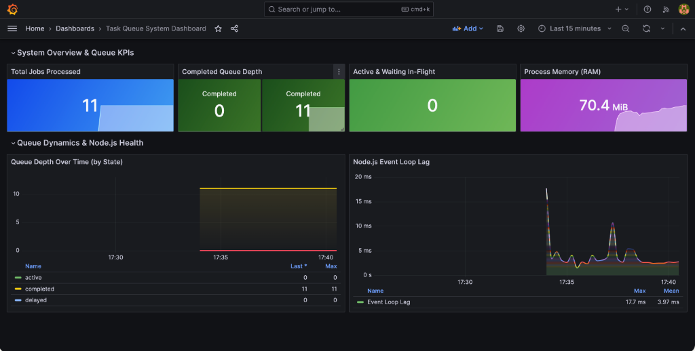

# Production-Grade Task Processing System

[](https://github.com/aj-jhaveri/task-queue-system/actions/workflows/ci.yml)
[](LICENSE)
[](.nvmrc)

**Live demo:** [slakedesign.com/demo/queue](https://slakedesign.com/demo/queue)
**Live queue dashboard:** [slake-task-queue.onrender.com/admin/queues](https://slake-task-queue.onrender.com/admin/queues)

> The dashboard is public and read-only. Dispatch a job from the demo page, then
> watch it move through the queue — no credentials required. Every mutating route
> is refused at the middleware layer, so queue state cannot be altered through it.
> See [SECURITY.md](SECURITY.md) for the boundary and
> [docs/design_decisions.md](docs/design_decisions.md) for how an always-on public
> dashboard is kept inside a free Redis tier's command budget.

Asynchronous background task processing microservice built with **Node.js**, **TypeScript**, **BullMQ**, **Redis**, **Express**, **Pino**, **Zod**, and **SQLite** — deployed on **Render** with **Upstash Cloud Redis**.

---

## What It Is

A production-grade microservice demonstrating robust background job queues, rate limiting, concurrency management, dead-letter queue (DLQ) routing, SQLite idempotency, Prometheus metrics, and real-time Bull Board observability.

**Production deployment:** The system runs continuously on Render with Upstash Cloud Redis (TLS, IPv4). UptimeRobot pings `/health` every 5 minutes — no cold starts. Dispatch real jobs at [slakedesign.com/demo/queue](https://slakedesign.com/demo/queue).

**Real work only.** This system has no mechanism for forcing a job to fail. Retries, exponential backoff, and DLQ routing are driven by genuine processor errors, not by a request field. See [docs/security-remediation.md](docs/security-remediation.md) for the Redis command-budget analysis behind the worker tuning.

## Why It Exists

Distributed backend systems require reliable execution of asynchronous side-effects (e.g., email notifications, heavy analytical report generation) isolated from client HTTP request loops. This project provides a battle-tested reference implementation addressing critical production concerns:
* **Durable Idempotency:** Blocking duplicate side-effects across Redis flushes or network retries.
* **Resilience:** Automatic retries with exponential backoff and automatic DLQ routing.
* **Observability:** Metrics scraping and interactive web UI for queue administration.

---

## What This Project Demonstrates

* **Asynchronous background processing**
* **Durable idempotency** (SQLite deduplication store)
* **Runtime validation** (Zod schemas on all input boundaries)
* **Worker concurrency** (5 concurrent workers, 100 jobs/min rate limit)
* **Retry and exponential backoff**
* **Dead-letter queue handling**
* **Structured logging** (Pino JSON)
* **Operational metrics** (Prometheus `/metrics`)
* **Health monitoring** (`/health` with Redis + SQLite status)
* **CI/CD automation** (GitHub Actions)
* **Automated testing** (Vitest)
* **Cloud Redis deployment** (Upstash + ioredis TLS, IPv4-forced for Node 24)

---

## Architecture

```text
Client
  │
  │  POST /api/jobs/email  (or /api/jobs/report)
  ▼
Express API (Zod Validation)
  │
  │  dispatchEmailJob() / dispatchReportJob()
  ▼
BullMQ Queue ──► Upstash Cloud Redis (rediss://, TLS)
                   │
                   ▼
               Task Worker (Concurrency: 5, Rate Limit: 100/min)
                   │
                   ▼
            Processor Registry
                   │
                   ├──► SQLite Idempotency Check
                   │      ├── (If Processed) ──► Return Cached Result
                   │      └── (If New) ────────► Execute Mock Business Logic
                   ▼
               Completed / (Failure ──► Exponential Retries ──► DLQ)
```

---

## Engineering Tradeoffs

### BullMQ + Redis vs. RabbitMQ / Kafka
* **Selected BullMQ** for native TypeScript typing, non-blocking Node.js integration, built-in rate-limiting, exponential retries, and zero-overhead local Docker development.

### Upstash Cloud Redis vs. Self-Hosted
* **Upstash** provides a serverless Redis with REST and TCP endpoints, free tier, and global availability — ideal for a portfolio deployment that stays warm with no ops overhead. TCP connection with ioredis requires explicit `host`/`port`/`password` parsing from the `REDIS_URL` and `family: 4` (IPv4) for Node 24 compatibility.

### SQLite as Idempotency Store
* Used **SQLite** to demonstrate durable side-effect deduplication (`idempotencyKey`) across Redis restarts without requiring a full PostgreSQL deployment.

---

## Key Features

* **Concurrency & Rate Limiting:** 5 concurrent worker threads per instance, worker-level rate limiting (100 jobs/min).
* **Idempotent Side-Effects:** SQLite primary datastore check prevents duplicate executions.
* **Dead Letter Queue (DLQ):** Automatic failover to `dlq-task-queue` on max retry exhaustion.
* **Observability:** Prometheus `/metrics` endpoint and Bull Board dashboard, both behind admin authentication in deployed environments.
* **Runtime Type Safety:** Strict Zod schema validation on input boundaries. Unknown fields are rejected, not silently stripped.
* **Abuse Resistance:** Per-IP and global in-memory HTTP rate limiting, a queue-depth ceiling, an explicit CORS allowlist, and bounded job retention.
* **Cloud Deployment:** Runs on Render with Upstash Cloud Redis. Zero cold starts via UptimeRobot keepalive.

---

## Visual Previews & Observability

### 1. Grafana Dashboard (`http://localhost:3001`)
Pre-configured, auto-provisioned Grafana dashboard (*Login: `admin` / `admin`*):



* **Live Queue Depth**: Active, waiting, completed, and failed job counts over time.
* **Processing Latency**: Real-time histograms for job execution durations.
* **System Metrics**: Node.js event loop lag and RAM memory usage.

### 2. Bull Board Dashboard

**Local:** `http://localhost:3000/admin/queues`
**Deployed:** [slake-task-queue.onrender.com/admin/queues](https://slake-task-queue.onrender.com/admin/queues)

The dashboard is public and read-only in every environment. Two controls make that
safe rather than reckless:

* **No writes.** `readOnlyMode` on the queue adapters hides the destructive
  controls, and `dashboardReadOnlyGuard` refuses every non-`GET` method with a
  `405` before the request reaches Bull Board. The guard is the real boundary:
  `readOnlyMode` alone only hides buttons, while the `add`, `retry`, `empty`,
  `pause`, and `obliterate` handlers stay mounted underneath.
* **No runaway cost.** Bull Board polls one route, `GET /api/queues`. That route is
  answered from an in-process snapshot cache, so Redis spend is decoupled from both
  viewer count and poll rate. The snapshot is invalidated the moment a job is
  dispatched, completed, or fails, so the board goes live on real events instead of
  on a timer.

```text
┌─────────────────────────────────────────────────────────────────────────────────┐
│ Bull Board - Queue Management                                                   │
├─────────────────────────────────────────────────────────────────────────────────┤
│ Queue: task-processing-queue                                                    │
│ [Active: 0]  [Waiting: 0]  [Completed: 12]  [Failed: 0]  [Delayed: 0]          │
├─────────────────────────────────────────────────────────────────────────────────┤
│ Queue: dlq-task-queue                                                           │
│ [Active: 0]  [Waiting: 0]  [Completed: 0]   [Failed: 3]  [Delayed: 0]          │
└─────────────────────────────────────────────────────────────────────────────────┘
```

### 3. Prometheus Metrics (`http://localhost:3000/metrics`, admin-protected outside local development)
```text
# HELP task_queue_jobs_processed_total Total number of task queue jobs processed
# TYPE task_queue_jobs_processed_total counter
task_queue_jobs_processed_total{job_type="EMAIL_NOTIFICATION",status="success"} 89
task_queue_jobs_processed_total{job_type="REPORT_GENERATION",status="success"} 53

# HELP task_queue_processing_duration_seconds Task processing duration in seconds
# TYPE task_queue_processing_duration_seconds histogram
task_queue_processing_duration_seconds_bucket{job_type="EMAIL_NOTIFICATION",le="0.1"} 89
```

### 4. Structured Pino Logger Output
```json
{"level":30,"time":1774569600000,"pid":1234,"env":"development","jobId":"email_key_101","idempotencyKey":"key_101","attempt":0,"msg":"Processing email job"}
{"level":30,"time":1774569600050,"pid":1234,"env":"development","jobId":"email_key_101","idempotencyKey":"key_101","durationMs":48,"messageId":"msg_1774569600_a8b9c0","msg":"Email job successfully executed"}
```

### 5. Duplicate Job Idempotency Skip Log
```json
{"level":40,"time":1774569605000,"pid":1234,"env":"development","jobId":"email_key_101","idempotencyKey":"key_101","msg":"Duplicate job execution blocked by SQLite primary datastore idempotency check"}
```

### 6. DLQ Escalation Log
A genuine processor error that survives all three attempts is routed to the DLQ:
```json
{"level":50,"time":1774569610000,"pid":1234,"env":"development","dlqJobId":"dlq_report_key_500_1774569610","originalJobId":"report_key_500","jobName":"REPORT_GENERATION","reason":"SQLITE_IOERR: disk I/O error","msg":"Job exhausted all retry attempts and moved to Dead Letter Queue (DLQ)"}
```

---

## Quick Start

### Option A: Try the Live Demo

Dispatch a real job at [slakedesign.com/demo/queue](https://slakedesign.com/demo/queue) or call the API directly:

```bash
# Dispatch an email job to the live production system
curl -X POST https://slake-task-queue.onrender.com/api/jobs/email \
  -H "Content-Type: application/json" \
  -d '{
    "to": "alice@example.com",
    "subject": "System Alert",
    "body": "Your task processing system is online.",
    "idempotencyKey": "email_demo_001"
  }'

# Check health
curl https://slake-task-queue.onrender.com/health
```

The deployed Bull Board dashboard is authentication-protected and deliberately not
linked here. Run the stack locally to inspect queues in the UI.

### Option B: Run Locally

#### 1. Start Redis
```bash
docker compose up -d
```

#### 2. Install Dependencies
```bash
npm install
```

#### 3. Run Development Server
```bash
npm run dev
```

#### 4. Interactive Terminal CLI Tester
In a separate terminal window:
```bash
npm run cli
```

#### 5. Run Automated Tests
```bash
npm test
```

#### 6. Postman API Collection
Import `task-queue-system.postman_collection.json` into **Postman** or **Bruno** to test all endpoints with 1 click.

#### 7. Typecheck & Build
```bash
npm run typecheck
npm run build
```

---

## REST API

### Dispatch Email Job
```bash
curl -X POST https://slake-task-queue.onrender.com/api/jobs/email \
  -H "Content-Type: application/json" \
  -d '{
    "to": "alice@example.com",
    "subject": "System Alert",
    "body": "Your task processing system is online.",
    "idempotencyKey": "email_demo_001"
  }'
```

### Dispatch Report Job
```bash
curl -X POST https://slake-task-queue.onrender.com/api/jobs/report \
  -H "Content-Type: application/json" \
  -d '{
    "reportType": "FINANCIAL",
    "userEmail": "finance@company.com",
    "filters": { "quarter": "Q3", "year": 2026 },
    "idempotencyKey": "report_demo_001"
  }'
```

### Dispatch Webhook Delivery Job

```bash
curl -X POST https://slake-task-queue.onrender.com/api/jobs/webhook \
  -H "Content-Type: application/json" \
  -d '{
    "destination": "DEMO_UNAVAILABLE",
    "event": "demo.retry_showcase",
    "idempotencyKey": "webhook_demo_001"
  }'
```

This is the retry demonstration, and it contains no simulation. The processor
performs a real HTTP `POST`; `DEMO_UNAVAILABLE` resolves to a loopback path that is
deliberately not served, so the delivery genuinely fails. BullMQ then applies its
real retry policy — 3 attempts with exponential backoff — and routes the exhausted
job to `dlq-task-queue`, where it is visible in the public dashboard.

`destination` is an enum, never a URL. Callers select a *name* and the service maps
it to an address internally, so there is no input that can point this job at
metadata endpoints, internal hosts, or third parties.

| Destination | Behaviour |
|---|---|
| `DEMO_AVAILABLE` | Delivers to a loopback sink that returns `200`. Job succeeds |
| `DEMO_UNAVAILABLE` | Target path is not served. Job fails for real, retries 3×, then lands in the DLQ |

Payload schemas are strict: unknown fields are rejected with `400`. There is no
request field that can force a job to fail — failure comes from the dependency,
not from the request.

### Response Codes

| Code | Meaning |
|---|---|
| `202` | Job accepted and queued |
| `400` | Payload failed schema validation, or contained an unknown field |
| `429` | Per-IP or global rate limit exceeded, or the queue-depth ceiling was reached |
| `503` | Redis backend unavailable (producer fails fast rather than buffering) |

### Health Check
```bash
curl https://slake-task-queue.onrender.com/health
# → {"status":"HEALTHY","timestamp":"...","services":{"redis":"UP","sqlite":"UP","worker":"UP"}}
```

---

## Environment Variables (Render / Production)

`REDIS_URL` is the sole Redis connection variable.

**Required**

| Variable | Description |
|---|---|
| `REDIS_URL` | Full Upstash Cloud Redis connection string. Copy the TCP URL from Upstash's **Redis** connect tab (`redis://default:<password>@<host>.upstash.io:6379`), not the REST URL — the REST URL carries no password and fails authentication silently |
| `NODE_ENV` | Set to `production` |
| `PORT` | HTTP server port (Render sets this automatically) |
| `CORS_ALLOWED_ORIGINS` | Comma-separated browser origin allowlist. Wildcards are ignored |

**Optional — admin credentials**

| Variable | Description |
|---|---|
| `BULLBOARD_USER` | Username for `/metrics` |
| `BULLBOARD_PASSWORD` | Password for `/metrics` |

These guard `/metrics` only. The queue dashboard is public and read-only and does
not use them. If either is unset, `/metrics` refuses every request (fail closed)
rather than serving unauthenticated; nothing else is affected.

**Optional (safe defaults shown)**

| Variable | Default | Description |
|---|---|---|
| `WORKER_DRAIN_DELAY_SECONDS` | `60` | Idle long-poll duration. Load-bearing for the Redis command budget |
| `WORKER_STALLED_INTERVAL_MS` | `300000` | Stalled-job check interval. Load-bearing for the Redis command budget |
| `WORKER_CONCURRENCY` | `5` | Concurrent jobs per instance |
| `RATE_LIMIT_MAX` | `100` | BullMQ worker-side processing limit per window |
| `RATE_LIMIT_DURATION_MS` | `60000` | BullMQ worker-side limiter window |
| `HTTP_RATE_LIMIT_MAX_PER_IP` | `20` | HTTP job submissions per IP per window |
| `HTTP_RATE_LIMIT_MAX_GLOBAL` | `200` | HTTP job submissions from all clients per window |
| `HTTP_RATE_LIMIT_WINDOW_MS` | `60000` | HTTP rate limit window |
| `MAX_QUEUE_DEPTH` | `1000` | Pending-job ceiling; submissions beyond it return `429` |
| `QUEUE_DEPTH_CACHE_TTL_MS` | `5000` | TTL for the on-demand depth read |
| `JSON_BODY_LIMIT` | `16kb` | Maximum request body size |
| `TRUST_PROXY_HOPS` | `1` | Proxy hops to trust for client IP resolution |

### Redis Command Budget

Upstash's free tier allows 500,000 commands/month (~16,667/day). BullMQ's stock
worker defaults cost roughly **37,440 commands/day while completely idle** — about
225% of the monthly cap before a single job is submitted. The tuned defaults above
reduce idle consumption to roughly **3,168 commands/day (~95,040/month, ~19% of
cap)** without affecting job pickup latency, retry timing, or DLQ behavior.

Full derivation, including the Bull Board polling cost, is in
[docs/security-remediation.md](docs/security-remediation.md).

---

## Documentation Links

* [Security Policy (`SECURITY.md`)](SECURITY.md)
* [Security Remediation & Redis Budget Analysis (`docs/security-remediation.md`)](docs/security-remediation.md)
* [System Architecture (`docs/architecture.md`)](docs/architecture.md)
* [Design Decisions & Engineering Tradeoffs (`docs/design_decisions.md`)](docs/design_decisions.md)
* [Deployment & Operations (`docs/deployment.md`)](docs/deployment.md)
* [Troubleshooting & DLQ Guide (`docs/troubleshooting.md`)](docs/troubleshooting.md)
