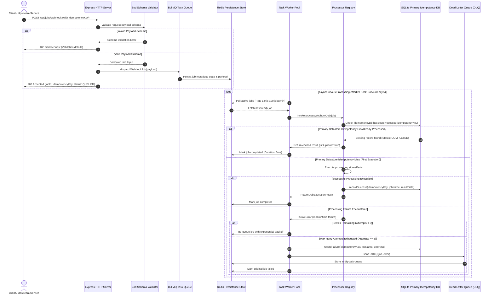

# System Architecture Specification

## Overview & System Motivation

Modern asynchronous distributed backend systems require reliable background processing decoupled from HTTP request-response cycles. When web applications perform resource-intensive operations (such as generating large PDF/Excel financial reports or sending batch transactional emails), executing these tasks synchronously inside HTTP handlers causes high latency, risk of client request timeouts, and poor user experience.

This system provides an asynchronous task execution engine built with Node.js, TypeScript, BullMQ, Redis, Pino, Zod, and SQLite.

---

## High-Level Sequence Diagram



---

## Detailed Component Architecture

```text
┌──────────────────────────────────────────────────────────────────────────────────────────────────┐
│                                       EXPRESS HTTP API LAYER                                     │
│  ┌───────────────────────┐   ┌────────────────────────┐   ┌───────────────────────────────────┐  │
│  │  POST /api/jobs/email │   │ POST /api/jobs/webhook │   │  GET /health | GET /metrics       │  │
│  └───────────┬───────────┘   └───────────┬────────────┘   └─────────────────┬─────────────────┘  │
└──────────────│───────────────────────────│──────────────────────────────────│────────────────────┘
               │                           │                                  │
               ▼                           ▼                                  ▼
┌────────────────────────────────────────────────────────┐          ┌───────────────────────────┐
│              ZOD RUNTIME SCHEMA VALIDATOR              │          │ PROMETHEUS METRICS        │
│    (EmailJobDataSchema / WebhookJobDataSchema)          │          │ (prom-client collector)   │
└──────────────────────────┬─────────────────────────────┘          └───────────────────────────┘
                           │
                           ▼
┌──────────────────────────────────────────────────────────────────────────────────────────────────┐
│                                       BULLMQ QUEUE SUBSYSTEM                                     │
│  ┌───────────────────────────────────────────────────┐   ┌────────────────────────────────────┐  │
│  │   Primary Task Queue: task-processing-queue       │   │   Dead Letter Queue: dlq-task-queue │  │
│  │   - removeOnComplete: 1000                        │   │   - removeOnComplete: false        │  │
│  │   - removeOnFail: 5000                            │   │   - removeOnFail: false            │  │
│  │   - attempts: 3 (exponential backoff)             │   │   - Stores persistent failures     │  │
│  └───────────────────────┬───────────────────────────┘   └─────────────────▲──────────────────┘  │
└──────────────────────────│─────────────────────────────────────────────────│─────────────────────┘
                           │                                                 │ (On Max Retries)
                           ▼                                                 │
┌────────────────────────────────────────────────────────────────────────────┴─────────────────────┐
│                                    REDIS PERSISTENCE DATASTORE                                   │
│  - Stores job state (waiting, active, completed, failed, delayed)                                │
│  - Memory policy: --maxmemory 256mb --maxmemory-policy noeviction                                │
└──────────────────────────┬───────────────────────────────────────────────────────────────────────┘
                           │
                           ▼
┌──────────────────────────────────────────────────────────────────────────────────────────────────┐
│                                     TASK WORKER ENGINE                                           │
│  - Concurrency: 5 concurrent execution loops                                                      │
│  - Rate Limiter: Max 100 jobs per 60,000 ms                                                      │
│  - Automatic Prometheus metrics recording                                                        │
└──────────────────────────┬───────────────────────────────────────────────────────────────────────┘
                           │
                           ▼
┌──────────────────────────────────────────────────────────────────────────────────────────────────┐
│                                  PROCESSOR REGISTRY & EXECUTION                                  │
│  - EMAIL_NOTIFICATION ──► processEmailJob()                                                      │
│  - WEBHOOK_DELIVERY   ──► processWebhookJob()                                                     │
│  - WEBHOOK_DELIVERY   ──► processWebhookJob()   (real HTTP; genuine failures)                    │
└──────────────────────────┬───────────────────────────────────────────────────────────────────────┘
                           │
                           ▼
┌──────────────────────────────────────────────────────────────────────────────────────────────────┐
│                              PRIMARY DATASTORE IDEMPOTENCY CHECK                                 │
│  SQLite Database: idempotency.db                                                                 │
│  Table: idempotency_records (key PRIMARY KEY, job_name, status, result_json, created_at)        │
│  - Prevents duplicate side-effects even across Redis restarts or network retries                 │
└──────────────────────────────────────────────────────────────────────────────────────────────────┘
```

---

## Core Operational Guarantees

### 1. Primary Datastore Idempotency Guarantee
Queue systems often guarantee **at-least-once delivery**. If a worker succeeds in executing a job but fails to acknowledge Redis due to a transient network partition, Redis will re-deliver the job. To prevent duplicate execution of non-idempotent side-effects (e.g. double-charging a credit card or sending duplicate email notifications), the worker verifies the `idempotencyKey` in SQLite *before* executing business logic.

If an entry exists with `status = 'COMPLETED'`, the worker immediately returns the previously persisted result payload with `isDuplicate: true` without re-executing side-effects.

### 2. Dead Letter Queue (DLQ) Isolation
When a job fails due to an unhandled exception or upstream service failure, BullMQ retries the job up to 3 times using exponential backoff (1s, 2s, 4s). If all 3 attempts are exhausted, the worker catches the terminal failure, constructs a `DLQPayload` (containing original job data, error message, stacktrace, and attempt counts), and pushes it to `dlq-task-queue` for manual inspection via Bull Board or CLI.

### 3. Graceful Shutdown & Drain Sequence
When the application receives a termination signal (`SIGINT` or `SIGTERM`), the service executes a structured shutdown sequence:
1. Stop the Express HTTP server from accepting new incoming HTTP connections.
2. Stop the BullMQ Worker instance (`worker.close()`), allowing active in-flight jobs up to 10 seconds to finish execution cleanly.
3. Close the main task queue and DLQ connection instances.
4. Close the SQLite database connection pool.
5. Close the Singleton Redis connection pool.
